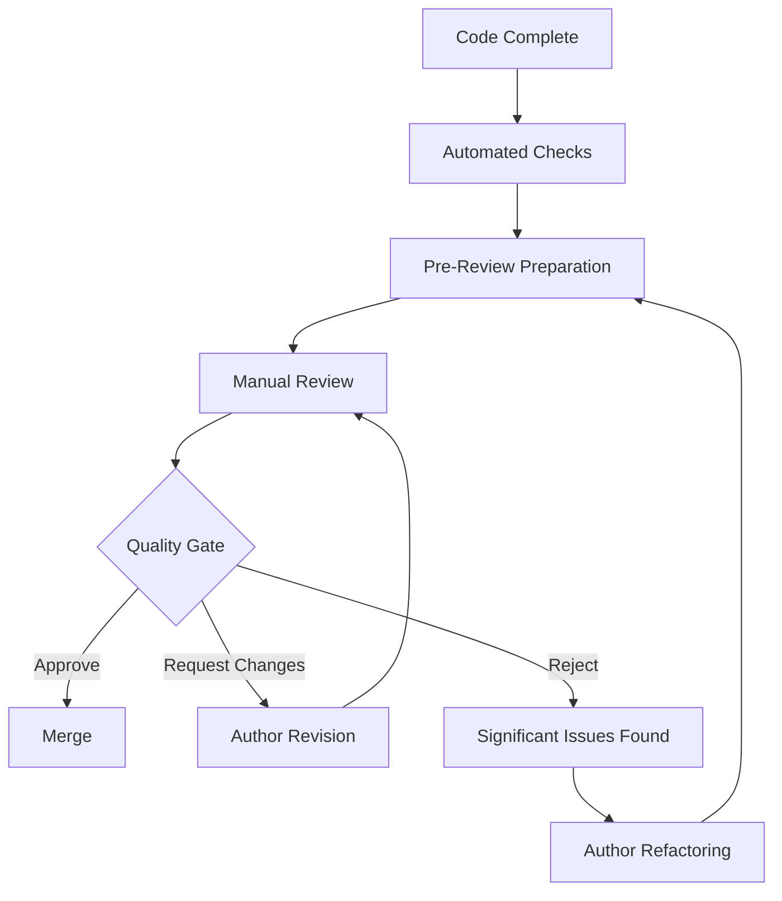

# Manual Code Review Process

## Overview

This document outlines the structured process for conducting manual code reviews in the Attrition project. Manual reviews complement automated tools (ESLint, TypeScript, metrics) by catching issues related to design, architecture, game logic, and project-specific patterns that automated tools cannot detect.

## Process Goals

- **Quality Assurance**: Catch issues not detectable by automated tools
- **Knowledge Sharing**: Distribute domain knowledge across team members
- **Consistency**: Ensure adherence to project patterns and conventions
- **Continuous Improvement**: Identify areas for process and code improvement
- **Risk Mitigation**: Reduce bugs and security issues before deployment

## Review Workflow

## Phase 1: Pre-Review Preparation

### 1.1 Author Responsibilities

#### Code Quality Checklist
Before requesting review, authors must ensure:

- [ ] **Automated Checks Pass**: ESLint, TypeScript compilation, and tests pass
- [ ] **Code Style**: Consistent formatting and naming conventions followed
- [ ] **Documentation**: Complex logic documented with clear comments
- [ ] **Testing**: New features include appropriate unit and integration tests
- [ ] **Error Handling**: Proper error handling and user feedback implemented
- [ ] **Performance**: No obvious performance issues or unnecessary operations

#### Pull Request Preparation
- **Descriptive Title**: Clear, concise summary of changes
- **Comprehensive Description**: What, why, and how of the changes
- **Related Issues**: Link to relevant tasks, bugs, or feature requests
- **Testing Instructions**: How reviewers can test the changes
- [ ] **Breaking Changes**: Clearly marked if API or behavior changes
- [ ] **Screenshots/Demos**: Visual changes documented when applicable

### 1.2 Reviewer Selection

#### Choose Appropriate Reviewers
- **Domain Expertise**: Reviewer familiar with affected game systems
- **Code Ownership**: Include original authors of related code
- **Workload Balance**: Distribute reviews across available team members
- **Skill Development**: Include junior developers for learning opportunities

#### Review Assignment Guidelines
- **Feature Development**: 2-3 reviewers including domain expert
- **Bug Fixes**: 1-2 reviewers familiar with affected system
- **Refactoring**: 2 reviewers including architecture expert
- **Critical Changes**: 3+ reviewers for security or performance changes

## Phase 2: Review Execution

### 2.1 Initial Review Setup

#### Environment Preparation
1. **Pull Latest Changes**: Ensure local branch is up to date
2. **Test Setup**: Configure test environment matching production
3. **Dependencies**: Install/update all required dependencies
4. **Build Verification**: Confirm project builds successfully

#### Code Navigation Strategy
1. **High-Level Overview**: Understand overall change scope and impact
2. **File-by-File Review**: Systematic examination of each modified file
3. **Integration Points**: Check how changes affect other systems
4. **Data Flow**: Trace how data moves through the affected components

### 2.2 Systematic Code Review

#### Use Structured Checklists
Apply appropriate checklists based on change type:

- **Fowler's Taxonomy**: [fowler-taxonomy-checklist.md](../checklists/fowler-taxonomy-checklist.md)
- **Project-Specific**: [project-specific-checklist.md](../checklists/project-specific-checklist.md)
- **Security**: [security-checklist.md](../checklists/security-checklist.md)
- **Performance**: [performance-checklist.md](../checklists/performance-checklist.md)

#### Review Areas by Component Type

##### Frontend Components (React/TypeScript)
- **State Management**: Proper state handling and updates
- **User Experience**: Responsive design and accessibility
- **Real-time Updates**: WebSocket integration and error handling
- **Game Logic**: Correct implementation of game mechanics
- **TypeScript Usage**: Proper typing and type safety

##### Backend Services (Node.js/TypeScript)
- **Business Logic**: Correct game mechanics implementation
- **Database Operations**: Efficient queries and proper error handling
- **API Design**: RESTful endpoints and proper HTTP status codes
- **Service Integration**: Clean separation of concerns
- **Real-time Features**: WebSocket broadcasting and subscription management

##### Game Logic and Systems
- **Game Balance**: Resource calculations and progression mechanics
- **Multiplayer Coordination**: Synchronization and conflict resolution
- **Performance Impact**: Game loop efficiency and resource usage
- **Save/Load Integrity**: Data persistence and restoration

## Phase 3: Review Feedback

### 3.1 Feedback Structure

#### Use Code Review Template
Follow the structured format in [code-review-template.md](../templates/code-review-template.md):

1. **Overall Assessment**: General impression and summary
2. **Positive Feedback**: What was done well
3. **Issues Found**: Specific problems with clear descriptions
4. **Suggestions**: Improvement recommendations
5. **Questions**: Points needing clarification
6. **Approval Decision**: Clear approve/request changes/reject

#### Feedback Quality Guidelines
- **Specific**: Point to exact lines/files with concrete examples
- **Constructive**: Focus on improvement, not personal criticism
- **Actionable**: Provide clear steps for addressing issues
- **Educational**: Explain why something is a problem or best practice
- **Balanced**: Include positive feedback along with criticism

### 3.2 Issue Prioritization

#### Critical Issues (Must Fix)
- **Security Vulnerabilities**: Authentication, authorization, data exposure
- **Game-Breaking Bugs**: Functionality preventing core gameplay
- **Performance Degradation**: Significant impact on game responsiveness
- **Data Corruption**: Risk of losing player progress or game state

#### Major Issues (Should Fix)
- **Code Smells**: Fowler's taxonomy violations
- **Architectural Problems**: Violations of established patterns
- **Maintainability Issues**: Code difficult to understand or modify
- **Test Coverage Gaps**: Missing tests for critical functionality

#### Minor Issues (Nice to Fix)
- **Code Style**: Inconsistent formatting or naming
- **Documentation**: Missing or unclear comments
- **Optimization Opportunities**: Potential performance improvements
- **Best Practice Deviations**: Non-critical pattern violations

## Phase 4: Quality Gate Decision

### 4.1 Approval Criteria

#### Automatic Approval Conditions
All of these must be met for approval:
- [ ] **No Critical Issues**: Zero security, game-breaking, or data corruption issues
- [ ] **Automated Checks Pass**: ESLint, TypeScript, and test suite pass
- [ ] **Author Response**: All reviewer questions answered satisfactorily
- [ ] **Testing Verified**: Changes tested and working as expected

#### Conditional Approval (Request Changes)
Use when fixes are straightforward:
- [ ] **Major Issues Present**: But fixable without significant rework
- [ ] **Clear Path Forward**: Specific steps identified for resolution
- [ ] **Low Risk**: Changes won't introduce new critical issues
- [ ] **Author Capability**: Author can reasonably implement fixes

#### Rejection Criteria
Use only for significant problems:
- [ ] **Critical Issues**: Security, game-breaking, or data corruption problems
- [ ] **Architectural Violations**: Fundamental design pattern violations
- [ ] **Scope Creep**: Changes far beyond original intent
- [ ] **Incomplete Implementation**: Core functionality not working

### 4.2 Decision Communication

#### Clear Communication Required
- **Decision Rationale**: Explain reasoning behind approval/rejection
- **Next Steps**: Specific actions required from author
- **Timeline Expectations**: Reasonable deadlines for addressing feedback
- **Support Offers**: Availability for questions or pair programming

## Phase 5: Post-Review Activities

### 5.1 Author Responsibilities

#### Address Feedback
1. **Understand Issues**: Ensure clear understanding of all feedback points
2. **Prioritize Fixes**: Address critical and major issues first
3. **Implement Changes**: Make required modifications
4. **Re-test**: Verify fixes work correctly and don't break existing functionality
5. **Respond**: Update PR with responses to all reviewer comments

#### Update Documentation
- [ ] **Code Comments**: Add clarifying comments for complex logic
- [ ] **README Updates**: Update documentation for user-facing changes
- [ ] **API Documentation**: Update endpoint documentation for backend changes
- [ ] **Memory Bank**: Update project memory bank for significant architectural changes

### 5.2 Reviewer Responsibilities

#### Follow-up Activities
- **Verification**: Confirm critical fixes are properly implemented
- **Testing**: Validate changes work as expected
- **Knowledge Transfer**: Share insights learned during review
- **Process Improvement**: Identify opportunities to improve review process

#### Review Quality Metrics
- **Issue Detection Rate**: Percentage of issues found in manual vs automated review
- **False Positive Rate**: Reviews that pass manual review but fail in production
- **Review Efficiency**: Time spent vs issues found
- **Author Satisfaction**: Feedback on review quality and helpfulness

## Phase 6: Continuous Improvement

### 6.1 Process Evaluation

#### Regular Review
- **Monthly Assessment**: Review process effectiveness and identify improvements
- **Team Feedback**: Gather input from authors and reviewers
- **Metrics Analysis**: Track review quality and efficiency metrics
- **Tool Evaluation**: Assess effectiveness of automated tools and checklists

#### Process Updates
- **Guideline Updates**: Revise checklists and templates based on findings
- **Training**: Provide additional training for common issues
- **Tool Enhancement**: Improve automated detection for frequently found issues
- **Standards Evolution**: Update coding standards based on project growth

### 6.2 Learning and Development

#### Knowledge Sharing
- **Review Patterns**: Document common issues and their solutions
- **Best Practices**: Share examples of excellent code and architecture
- **Game Development Insights**: Capture domain-specific knowledge and patterns
- **Tool Usage**: Document effective use of development and review tools

#### Team Development
- **Skill Building**: Use reviews as learning opportunities for junior developers
- **Mentorship**: Pair junior and senior developers for knowledge transfer
- **Cross-Training**: Ensure multiple team members understand each game system
- **Process Ownership**: Distribute responsibility for maintaining review quality

## Emergency Review Process

### Critical Hotfixes
For urgent fixes requiring immediate deployment:

1. **Rapid Review**: Single senior reviewer conducts focused review
2. **Critical Path Only**: Review only security, functionality, and data integrity
3. **Immediate Merge**: Merge once critical issues resolved
4. **Follow-up Review**: Full review process applied post-deployment
5. **Documentation**: All emergency changes documented for later review

### Security Incidents
For security-related issues:

1. **Immediate Isolation**: Code reviewed for security implications first
2. **Security Expert Review**: Include security specialist in review process
3. **Risk Assessment**: Evaluate potential security impact
4. **Mitigation Plan**: Develop strategy for addressing vulnerabilities
5. **Compliance Check**: Verify compliance with security standards

## Review Tools and Resources

### Development Environment
- **IDE Integration**: VS Code with ESLint, TypeScript, and custom rules
- **Git Platform**: GitHub pull requests with integrated review tools
- **CI/CD Pipeline**: Automated checks integrated with review process
- **Testing Framework**: Comprehensive test suite for validation

### Communication Tools
- **Code Comments**: GitHub comments for line-specific feedback
- **Review Discussions**: GitHub review threads for complex discussions
- **Chat Integration**: Slack/Discord for quick questions during review
- **Video Conferencing**: For complex reviews requiring screen sharing

### Quality Assurance Tools
- **ESLint Integration**: Automated linting with custom Attrition rules
- **TypeScript**: Compile-time type checking and IntelliSense
- **Test Coverage**: Code coverage reports and requirements
- **Performance Monitoring**: Tools for identifying performance regressions

---

## Success Indicators

- **Code Quality**: Measurable improvements in maintainability and reliability
- **Issue Prevention**: Reduction in bugs and security issues found in production
- **Team Learning**: Improved code quality across all team members
- **Process Efficiency**: Reviews completed within reasonable timeframes
- **Tool Integration**: Seamless workflow between manual and automated quality checks

**Last Updated**: 2025-10-10
**Version**: 1.0.0
**Status**: Active