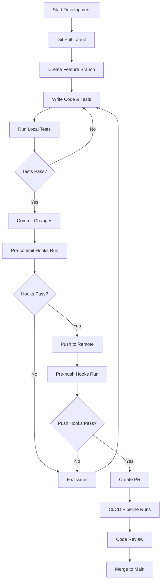

# Testing Workflow Integration Guide

## Overview

This guide explains how testing is seamlessly integrated into the Attrition development workflow, providing automated quality gates, continuous feedback, and comprehensive coverage validation.

## 🔄 Development Workflow

### Daily Development Flow



### Git Hooks Integration

#### Pre-commit Hook
Automatically runs before each commit:
- **Lint & Format**: Fixes code style issues automatically
- **Unit Tests**: Runs tests for modified files
- **Type Checking**: Validates TypeScript types

```bash
# Bypass pre-commit hooks (use sparingly)
HUSKY=0 git commit -m "Emergency fix"

# Or skip verification for specific commits
git commit --no-verify -m "WIP: temporary commit"
```

#### Pre-push Hook  
Runs before pushing to remote:
- **Feature Branches**: Standard test suite + integration tests
- **Main/Develop**: Comprehensive test suite including:
  - Full unit & integration test coverage
  - Multiplayer scenario tests
  - Game simulation tests
  - Performance benchmarks
  - E2E test suite

#### Post-merge Hook
Runs after pulling/merging updates:
- Updates dependencies if package.json changed
- Reinstalls test dependencies if test configs changed
- Provides notifications about important changes

## 📋 Testing Levels & Triggers

### Test Level Matrix

| Context | Trigger | Unit | Integration | E2E | Game Logic | Performance |
|---------|---------|------|-------------|-----|------------|-------------|
| **Pre-commit** | Local commit | ✅ | ❌ | ❌ | ❌ | ❌ |
| **Feature Branch Push** | Push to feature/* | ✅ | ✅ | ✅ | ❌ | ❌ |
| **PR to Develop** | Pull request | ✅ | ✅ | ✅ | ✅ | ❌ |
| **PR to Main** | Pull request | ✅ | ✅ | ✅ | ✅ | ✅ |
| **Main Branch** | Push to main | ✅ | ✅ | ✅ | ✅ | ✅ |
| **Manual Trigger** | Workflow dispatch | Configurable | Configurable | Configurable | Configurable | Configurable |

### CI/CD Test Levels

#### Quick (< 5 minutes)
- Unit tests only
- Basic linting and type checking
- Used for: rapid feedback, draft PRs

#### Standard (< 15 minutes)
- Unit + integration tests
- E2E test suite
- Code quality checks
- Used for: feature branch development

#### Comprehensive (< 30 minutes)
- All standard tests
- Game logic simulation tests
- Performance benchmarking
- Used for: PRs to main, release candidates

#### Full (< 60 minutes)
- All comprehensive tests
- Extended multiplayer scenarios
- Cross-browser compatibility
- Visual regression testing
- Used for: main branch, releases

## 🛠️ Local Development

### Quick Start Commands

```bash
# Install dependencies and set up hooks
pnpm install

# Start development with live testing
pnpm run dev:full

# Run specific test suites
pnpm run test:unit          # Unit tests only
pnpm run test:integration   # Integration tests
pnpm run test:multiplayer   # Multiplayer scenarios
pnpm run test:game-simulation # Game logic tests

# Watch mode for active development
pnpm run test:watch         # Watch all tests
pnpm run test:watch:unit    # Watch unit tests only

# Coverage analysis
pnpm run test:coverage      # Generate coverage reports
```

### Development Modes

#### Standard Development
```bash
# Start servers with hot reload
pnpm run dev

# Run tests in watch mode (separate terminal)
pnpm run test:watch
```

#### Test-Driven Development
```bash
# Start development with integrated testing
pnpm run dev:full

# This runs:
# - Server with hot reload
# - Client with hot reload  
# - Tests in watch mode
# - Type checking in watch mode
```

#### Performance-Focused Development
```bash
# Start with performance monitoring
pnpm run dev
pnpm run test:performance --watch
```

## 🎯 Testing Best Practices

### Test Organization

```
packages/server/src/
├── __tests__/
│   ├── unit/                 # Unit tests
│   │   ├── services/
│   │   ├── models/
│   │   └── utils/
│   ├── integration/          # Integration tests
│   │   ├── api/
│   │   ├── database/
│   │   └── services/
│   └── e2e/                  # End-to-end tests
│       ├── auth/
│       ├── game/
│       └── multiplayer/
├── test-utils/               # Testing utilities
│   ├── game-simulation-framework.ts
│   ├── multiplayer-testing-framework.ts
│   └── test-helpers.ts
└── services/                 # Source code
    ├── GameService.ts
    └── GameService.test.ts   # Co-located tests
```

### Writing Effective Tests

#### Unit Tests
```typescript
// Good: Focused, fast, isolated
describe('ResourceCalculator', () => {
  test('calculates energy production correctly', () => {
    const calculator = new ResourceCalculator();
    const result = calculator.calculateEnergyProduction(
      { solarPanels: 5, level: 2 }
    );
    expect(result).toBe(100);
  });
});
```

#### Integration Tests
```typescript
// Good: Tests actual component integration
describe('Empire Creation Flow', () => {
  test('creates empire with starting resources', async () => {
    const response = await request(app)
      .post('/api/empires')
      .send({ name: 'Test Empire', userId: 'user123' });
    
    expect(response.status).toBe(201);
    expect(response.body.resources.credits).toBe(10000);
    
    // Verify database state
    const empire = await Empire.findById(response.body.id);
    expect(empire.territories).toHaveLength(1);
  });
});
```

#### Game Logic Tests
```typescript
// Good: Uses game simulation framework
describe('Tech Research System', () => {
  test('researches technology with proper prerequisites', async () => {
    const engine = new GameSimulationEngine();
    const empire = await engine.createEmpire({
      resources: { research: 5000 },
      technologies: new Map([['basic_research', 1]])
    });

    await engine.startTechResearch(empire.empireId, 'advanced_computing');
    await engine.simulateTime(3600000); // 1 hour

    const result = await engine.getEmpireState(empire.empireId);
    expect(result.technologies.has('advanced_computing')).toBe(true);
  });
});
```

### Test Data Management

#### Test Database Setup
```typescript
// test-setup.ts
import { MongoMemoryServer } from 'mongodb-memory-server';
import mongoose from 'mongoose';

let mongod: MongoMemoryServer;

beforeAll(async () => {
  mongod = await MongoMemoryServer.create();
  const uri = mongod.getUri();
  await mongoose.connect(uri);
});

afterAll(async () => {
  await mongoose.connection.dropDatabase();
  await mongoose.connection.close();
  await mongod.stop();
});
```

#### Test Factories
```typescript
// test-factories.ts
export const createTestEmpire = async (overrides = {}) => {
  const empire = new Empire({
    name: 'Test Empire',
    userId: 'test-user',
    territories: ['A00:00:00:00'],
    resources: { credits: 10000, energy: 5000 },
    ...overrides
  });
  
  return await empire.save();
};
```

## 📊 Test Coverage & Quality Gates

### Coverage Requirements

| Component | Minimum Coverage |
|-----------|------------------|
| **Services** | 85% |
| **Models** | 80% |
| **Controllers** | 75% |
| **Utilities** | 90% |
| **Overall Project** | 80% |

### Quality Gates

#### Merge to Develop
- ✅ All unit tests pass
- ✅ All integration tests pass  
- ✅ Code coverage ≥ 75%
- ✅ No ESLint errors
- ✅ TypeScript compilation successful

#### Merge to Main
- ✅ All tests pass (including game logic)
- ✅ Code coverage ≥ 80%
- ✅ Performance benchmarks within thresholds
- ✅ E2E tests pass
- ✅ No security vulnerabilities

### Branch Protection Rules

```yaml
# GitHub branch protection settings
main:
  required_status_checks:
    - "Code Quality"
    - "Unit & Integration Tests"
    - "Game Logic Tests"
    - "E2E Tests"
    - "Performance Tests"
  enforce_admins: true
  required_pull_request_reviews:
    required_approving_review_count: 2

develop:
  required_status_checks:
    - "Code Quality"
    - "Unit & Integration Tests" 
    - "Game Logic Tests"
  required_pull_request_reviews:
    required_approving_review_count: 1
```

## 🚀 CI/CD Integration

### Pipeline Stages

#### 1. Setup & Validation (2-3 mins)
- Dependency installation & caching
- Affected package detection
- Test level determination
- Environment setup

#### 2. Code Quality (3-5 mins)
- ESLint with auto-fix suggestions
- Prettier formatting validation
- TypeScript type checking
- Security vulnerability scanning

#### 3. Testing (10-25 mins)
- **Unit Tests**: Fast, isolated component tests
- **Integration Tests**: Database and API integration
- **Game Logic Tests**: Simulation framework validation
- **Performance Tests**: Benchmark validation
- **E2E Tests**: Full application workflows

#### 4. Build Verification (5-8 mins)
- TypeScript compilation
- Bundle size analysis
- Asset optimization verification
- Build artifact validation

#### 5. Analysis & Reporting (2-3 mins)
- Test result aggregation
- Coverage report generation
- Performance regression analysis
- Deployment readiness evaluation

### Parallel Execution Strategy

```yaml
# Tests run in parallel for efficiency
jobs:
  unit-tests:
    strategy:
      matrix:
        package: [server, client, shared]
    # Runs simultaneously across packages
  
  game-tests:
    # Runs in parallel with unit tests
    # Only if server package affected
  
  build:
    # Runs in parallel with testing
    # Cached results used by E2E tests
```

## 🔧 Developer Tools & Scripts

### Package Scripts Reference

#### Root Level (workspace)
```bash
# Development
pnpm run dev                 # Start all services
pnpm run dev:full           # Dev + testing + type checking

# Testing
pnpm run test               # Run all tests
pnpm run test:unit          # Unit tests only
pnpm run test:integration   # Integration tests
pnpm run test:multiplayer   # Multiplayer scenarios
pnpm run test:coverage      # Coverage analysis
pnpm run test:ci            # CI-optimized test run

# Quality
pnpm run lint               # Lint all packages
pnpm run lint:fix           # Auto-fix linting issues
pnpm run type-check         # TypeScript validation
pnpm run format             # Format all files

# Workflow
pnpm run validate           # Quick validation (lint + type + unit)
pnpm run validate:full      # Full validation (+ integration)
pnpm run hooks:install      # Set up git hooks
```

#### Package Level
```bash
# Server-specific
pnpm --filter @game/server test:multiplayer
pnpm --filter @game/server test:game-simulation
pnpm --filter @game/server test:performance

# Client-specific  
pnpm --filter @game/client test:components
pnpm --filter @game/client test:ui

# Cross-package
pnpm --filter "@game/*" test:unit
```

### IDE Integration

#### VS Code Settings
```json
{
  "jest.jestCommandLine": "pnpm test",
  "jest.autoRun": "watch",
  "jest.showCoverageOnLoad": true,
  "typescript.preferences.includePackageJsonAutoImports": "auto",
  "eslint.format.enable": true,
  "editor.codeActionsOnSave": {
    "source.fixAll.eslint": true
  },
  "editor.formatOnSave": true
}
```

#### Recommended Extensions
- **Jest Test Explorer**: Visual test running
- **ESLint**: Real-time linting
- **Prettier**: Code formatting
- **TypeScript Importer**: Auto-import management
- **GitLens**: Git integration and history

## 📈 Monitoring & Metrics

### Test Execution Metrics

#### Performance Tracking
- Test execution time trends
- Coverage percentage over time
- Flaky test identification
- Build success/failure rates

#### Quality Metrics
- Code complexity scores
- Technical debt indicators
- Security vulnerability trends
- Performance regression tracking

### Dashboard Integration

#### Available Reports
- **Coverage Reports**: Line, branch, function coverage
- **Test Results**: Pass/fail trends, duration analysis
- **Performance Reports**: Benchmark comparisons
- **Quality Gates**: Pass/fail status for each gate

#### Accessing Reports
```bash
# Generate local coverage report
pnpm run test:coverage
open coverage/lcov-report/index.html

# View test results
open test-results/jest-html-report.html

# Performance analysis
open performance-results/benchmark-report.html
```

## 🚨 Troubleshooting

### Common Issues

#### Git Hooks Not Running
```bash
# Reinstall hooks
pnpm run hooks:install

# Check hook permissions (Unix/Mac)
chmod +x .husky/*

# Debug hook execution
HUSKY_DEBUG=1 git commit
```

#### Test Failures in CI vs Local
```bash
# Run tests in CI mode locally
NODE_ENV=test pnpm run test:ci

# Check for timing issues
pnpm run test --runInBand

# Verify environment variables
pnpm run test --verbose
```

#### Performance Test Timeouts
```bash
# Increase timeout for specific tests
pnpm run test:performance --testTimeout=60000

# Run performance tests in isolation
pnpm run test:performance --maxWorkers=1
```

#### Database Connection Issues
```bash
# Reset test database
pnpm run db:reset

# Check MongoDB memory server
pnpm run test --detectOpenHandles
```

### Getting Help

#### Debug Commands
```bash
# Verbose test output
pnpm run test --verbose

# Show test coverage details
pnpm run test:coverage --verbose

# Debug specific test files
pnpm run test path/to/test.ts --verbose

# Check for open handles (memory leaks)
pnpm run test --detectOpenHandles
```

#### Support Resources
- **Documentation**: `/docs` directory
- **Test Examples**: `/packages/*/src/__tests__/examples`
- **Framework Guides**: `/packages/server/src/test-utils`
- **Troubleshooting**: This document and GitHub issues

## 🔄 Continuous Improvement

### Feedback Loop

1. **Monitor**: Track test execution metrics and failure patterns
2. **Analyze**: Identify bottlenecks and pain points in the workflow
3. **Improve**: Enhance frameworks, add tooling, optimize processes
4. **Validate**: Measure improvements and gather developer feedback

### Future Enhancements

#### Planned Features
- [ ] **Automatic Test Generation**: AI-powered test case generation
- [ ] **Visual Testing**: Automated UI regression testing
- [ ] **Performance Budgets**: Automatic performance regression detection
- [ ] **Smart Test Selection**: Run only affected tests based on changes
- [ ] **Parallel E2E Testing**: Distributed E2E test execution
- [ ] **Real-time Collaboration**: Shared test execution visibility

#### Integration Opportunities
- [ ] **Slack Notifications**: Real-time test result updates
- [ ] **Jira Integration**: Automatic issue creation for test failures
- [ ] **Code Review Automation**: Automated code quality suggestions
- [ ] **Deployment Gates**: Automatic deployment based on test results

This comprehensive testing workflow integration ensures consistent quality, rapid feedback, and reliable deployments while maintaining developer productivity and code confidence.
