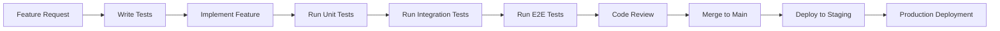

# Attrition Testing Strategy

## 📋 Table of Contents

- [Executive Summary](#executive-summary)
- [Testing Philosophy](#testing-philosophy)
- [Testing Pyramid](#testing-pyramid)
- [Testing Types and Coverage](#testing-types-and-coverage)
- [Testing Infrastructure](#testing-infrastructure)
- [Quality Gates and Metrics](#quality-gates-and-metrics)
- [Testing Workflow](#testing-workflow)
- [Tools and Frameworks](#tools-and-frameworks)
- [Best Practices](#best-practices)
- [Team Responsibilities](#team-responsibilities)
- [Continuous Improvement](#continuous-improvement)

---

## 🎯 Executive Summary

The Attrition testing strategy establishes a comprehensive, multi-layered approach to quality assurance that ensures the reliability, performance, and maintainability of our space empire MMO game. Our strategy encompasses automated testing at every level of the application stack, from individual functions to complete user journeys across multiple platforms.

### Key Objectives

- **Quality Assurance**: Maintain high code quality and prevent regressions
- **Developer Confidence**: Enable rapid, safe development and deployment
- **User Experience**: Ensure consistent, reliable gameplay across all platforms
- **Platform Coverage**: Support web, desktop (Windows/macOS/Linux), and mobile platforms
- **Performance Validation**: Maintain optimal performance under various conditions
- **Security Compliance**: Validate security controls and prevent vulnerabilities

### Strategic Outcomes

- **99.5% Uptime Target**: Through comprehensive monitoring and testing
- **< 2 Second Response Time**: For critical user interactions
- **Zero-Defect Deployment**: Via automated quality gates and validation
- **Cross-Platform Compatibility**: Consistent experience across all supported platforms

---

## 🏛️ Testing Philosophy

### Core Principles

#### 1. **Shift-Left Testing**
- Test early and often in the development cycle
- Catch issues at the lowest possible level
- Integrate testing into the development workflow

#### 2. **Automation First**
- Automate repetitive testing tasks
- Prioritize automated tests over manual testing
- Maintain high test automation coverage

#### 3. **Risk-Based Testing**
- Focus testing efforts on high-risk areas
- Prioritize critical user journeys and business logic
- Adapt testing intensity based on component criticality

#### 4. **Continuous Feedback**
- Provide immediate feedback to developers
- Integrate testing results into CI/CD pipeline
- Monitor and alert on quality metrics

#### 5. **Cross-Platform Consistency**
- Ensure consistent behavior across all platforms
- Test platform-specific integrations thoroughly
- Validate responsive design and accessibility

### Testing Mindset

- **Quality is Everyone's Responsibility**: Every team member contributes to quality
- **Test-Driven Development**: Write tests alongside or before implementation
- **Documentation as Code**: Keep test documentation up-to-date and versioned
- **Continuous Learning**: Adapt and improve testing practices based on experience

---

## 🔺 Testing Pyramid

Our testing strategy follows a well-defined testing pyramid that balances coverage, speed, and maintainability:

### Layer 1: Unit Tests (Base - 70% of tests)
**Purpose**: Test individual functions, components, and modules in isolation
**Coverage**: 80%+ code coverage target
**Speed**: < 1 second per test
**Scope**: Business logic, utilities, components, services

```
Examples:
- Game calculation functions (resource generation, combat resolution)
- React component rendering and interactions  
- API service methods and data transformations
- Utility functions and helpers
```

### Layer 2: Integration Tests (Middle - 20% of tests)
**Purpose**: Test interactions between components and external services
**Coverage**: API endpoints, database operations, third-party integrations
**Speed**: < 10 seconds per test
**Scope**: Service integration, database queries, external APIs

```
Examples:
- API endpoint functionality with database operations
- Authentication flow integration
- Payment processing integration
- Real-time communication (WebSocket) integration
```

### Layer 3: End-to-End Tests (Top - 10% of tests)
**Purpose**: Test complete user journeys and workflows
**Coverage**: Critical user paths, cross-browser compatibility
**Speed**: 30 seconds - 5 minutes per test
**Scope**: Full application workflows, user journeys

```
Examples:
- Complete game registration and onboarding flow
- Core gameplay loops (resource management, fleet operations)
- Cross-platform functionality validation
- Performance and accessibility validation
```

### Specialized Testing (Horizontal)
**Purpose**: Address specific quality attributes and requirements
**Coverage**: Performance, security, accessibility, platform-specific features
**Scope**: Non-functional requirements and specialized scenarios

```
Examples:
- Performance benchmarking and load testing
- Security vulnerability scanning
- Accessibility compliance validation
- Windows platform integration testing
```

---

## 🧪 Testing Types and Coverage

### 1. Functional Testing

#### Unit Testing
- **Framework**: Jest, React Testing Library
- **Coverage**: Business logic, utilities, components
- **Target**: 80%+ code coverage
- **Location**: `packages/*/src/**/*.test.ts`

```typescript
// Example: Game logic unit test
describe('ResourceCalculator', () => {
  test('should calculate hourly resource generation correctly', () => {
    const result = calculateResourceGeneration({
      baseProduction: 100,
      efficiency: 1.2,
      bonuses: [0.1, 0.05]
    });
    expect(result).toBe(138); // 100 * 1.2 * 1.15
  });
});
```

#### Integration Testing
- **Framework**: Jest, Supertest
- **Coverage**: API endpoints, database operations
- **Target**: All critical integration points
- **Location**: `packages/server/tests/integration/`

```typescript
// Example: API integration test
describe('Player API', () => {
  test('should create new player and return player data', async () => {
    const response = await request(app)
      .post('/api/players')
      .send({ username: 'testplayer', email: 'test@example.com' })
      .expect(201);
    
    expect(response.body.player).toHaveProperty('id');
    expect(response.body.player.username).toBe('testplayer');
  });
});
```

#### End-to-End Testing
- **Framework**: Playwright
- **Coverage**: User journeys, cross-browser compatibility
- **Target**: All critical user workflows
- **Location**: `e2e/tests/`

```typescript
// Example: E2E user journey test
test('complete game onboarding flow', async ({ page }) => {
  await page.goto('/');
  await page.click('[data-testid="register-button"]');
  await page.fill('[name="username"]', 'newplayer');
  await page.fill('[name="email"]', 'player@example.com');
  await page.click('[type="submit"]');
  
  await expect(page.locator('[data-testid="welcome-message"]')).toBeVisible();
  await expect(page).toHaveURL('/dashboard');
});
```

### 2. Non-Functional Testing

#### Performance Testing
- **Framework**: Playwright, Artillery, K6
- **Coverage**: Load testing, stress testing, performance monitoring
- **Target**: Response time < 2s, throughput > 1000 RPS
- **Location**: `e2e/performance/`

#### Security Testing
- **Framework**: OWASP ZAP, Snyk, CodeQL
- **Coverage**: Vulnerability scanning, dependency analysis
- **Target**: Zero high/critical vulnerabilities
- **Integration**: CI/CD pipeline

#### Accessibility Testing
- **Framework**: axe-core, Playwright accessibility testing
- **Coverage**: WCAG 2.1 AA compliance
- **Target**: Zero accessibility violations
- **Location**: `e2e/tests/accessibility/`

#### Visual Regression Testing
- **Framework**: Playwright visual comparisons
- **Coverage**: UI consistency across platforms/browsers
- **Target**: Zero unexpected visual changes
- **Location**: `e2e/visual/`

### 3. Platform-Specific Testing

#### Windows Desktop Testing
- **Framework**: Playwright Electron
- **Coverage**: Windows integration, native features
- **Target**: Full Windows compatibility
- **Location**: `e2e/tests/windows-*.spec.ts`

#### Mobile PWA Testing
- **Framework**: Playwright mobile emulation
- **Coverage**: Mobile responsiveness, PWA functionality
- **Target**: Mobile-first compatibility
- **Location**: `e2e/tests/mobile/`

#### Cross-Browser Testing
- **Framework**: Playwright multi-browser
- **Coverage**: Chrome, Firefox, Safari, Edge compatibility
- **Target**: Consistent behavior across browsers
- **Configuration**: `playwright.config.ts`

---

## 🏗️ Testing Infrastructure

### Development Environment

#### Local Testing Setup
```bash
# Install dependencies
pnpm install

# Run unit tests
pnpm test

# Run E2E tests
pnpm run e2e

# Run specific test suite
pnpm run test:unit
pnpm run test:integration
pnpm run test:e2e
```

#### Test Data Management
- **Database Seeding**: Automated test data creation
- **Mock Services**: External service simulation
- **State Management**: Isolated test environments
- **Cleanup**: Automated test data cleanup

### Continuous Integration

#### GitHub Actions Workflows

**Primary Testing Pipeline**: `.github/workflows/test.yml`
```yaml
name: Comprehensive Testing
on: [push, pull_request]
jobs:
  unit-tests:
    runs-on: ubuntu-latest
    steps:
      - uses: actions/checkout@v4
      - name: Run unit tests
        run: pnpm test --coverage
  
  e2e-tests:
    runs-on: ${{ matrix.os }}
    strategy:
      matrix:
        os: [ubuntu-latest, windows-latest, macos-latest]
    steps:
      - name: Run E2E tests
        run: pnpm run e2e
```

**Specialized Testing Workflows**:
- `windows-platform-tests.yml` - Windows-specific testing
- `performance-tests.yml` - Performance benchmarking
- `security-scan.yml` - Security vulnerability scanning

#### Quality Gates
1. **Code Coverage**: Minimum 80% coverage required
2. **Security Scan**: Zero high/critical vulnerabilities
3. **Performance**: Response time within thresholds
4. **Accessibility**: Zero WCAG violations
5. **Visual Regression**: No unexpected UI changes

### Testing Environments

#### Environment Hierarchy
1. **Local Development**: Developer workstations
2. **CI/CD Pipeline**: GitHub Actions runners
3. **Staging Environment**: Production-like testing
4. **Production Monitoring**: Live system validation

#### Environment Configuration
```typescript
// test.config.ts
export const testConfig = {
  development: {
    apiUrl: 'http://localhost:3000',
    database: 'sqlite://./test.db',
    timeout: 30000
  },
  ci: {
    apiUrl: process.env.TEST_API_URL,
    database: process.env.TEST_DATABASE_URL,
    timeout: 60000
  },
  staging: {
    apiUrl: 'https://staging-api.attrition.game',
    database: 'postgresql://staging-db',
    timeout: 45000
  }
};
```

---

## 📊 Quality Gates and Metrics

### Quality Gates

#### Code Quality Gates
- **Unit Test Coverage**: ≥ 80%
- **Integration Test Coverage**: 100% of API endpoints
- **E2E Test Coverage**: 100% of critical user journeys
- **Code Quality Score**: ≥ 8.0/10 (SonarQube)
- **Technical Debt**: ≤ 5% of codebase

#### Security Gates
- **Dependency Vulnerabilities**: Zero high/critical
- **SAST Findings**: Zero high/critical
- **DAST Findings**: Zero high/critical
- **License Compliance**: 100% compliant

#### Performance Gates
- **API Response Time**: ≤ 2 seconds (95th percentile)
- **Page Load Time**: ≤ 3 seconds (LCP)
- **Memory Usage**: ≤ 512MB (desktop app)
- **CPU Usage**: ≤ 30% (sustained load)

### Testing Metrics

#### Coverage Metrics
```typescript
// Coverage reporting configuration
const coverageConfig = {
  statements: 80,
  branches: 75,
  functions: 80,
  lines: 80,
  exclude: [
    'src/**/*.test.ts',
    'src/test-utils/**',
    'src/**/*.d.ts'
  ]
};
```

#### Performance Metrics
- **Test Execution Time**: Track and optimize test runtime
- **Build Pipeline Duration**: Target < 15 minutes total
- **Feedback Time**: Results available within 5 minutes
- **Flaky Test Rate**: ≤ 1% of test executions

#### Quality Metrics
- **Defect Escape Rate**: ≤ 5% of bugs found in production
- **Test Automation Rate**: ≥ 95% of tests automated
- **Mean Time to Recovery**: ≤ 15 minutes for test failures
- **Test Maintenance Effort**: ≤ 20% of development time

### Reporting and Dashboards

#### Test Results Dashboard
- Real-time test execution status
- Coverage trend analysis
- Performance benchmarks
- Quality gate compliance

#### Quality Metrics Dashboard
- Defect trends and analysis
- Test automation coverage
- Performance indicators
- Security posture

---

## 🔄 Testing Workflow

### Development Workflow

#### Test-Driven Development (TDD)
1. **Write Test**: Create failing test for new feature
2. **Implement Code**: Write minimal code to pass test
3. **Refactor**: Improve code while maintaining test coverage
4. **Integrate**: Run full test suite before committing

#### Feature Development Process


#### Branching Strategy Integration
- **Feature Branches**: Full test suite on PR creation
- **Main Branch**: Comprehensive testing + deployment
- **Release Branches**: Extended testing including performance
- **Hotfix Branches**: Focused regression testing

### Continuous Integration Workflow

#### Pull Request Pipeline
1. **Trigger**: PR creation or update
2. **Unit Tests**: Fast feedback on code changes
3. **Integration Tests**: Validate service interactions
4. **Security Scan**: Check for vulnerabilities
5. **Code Quality**: Static analysis and coverage
6. **E2E Tests**: Critical path validation
7. **Approval Gate**: Automated or manual approval

#### Main Branch Pipeline
1. **Merge Trigger**: PR merge to main
2. **Full Test Suite**: All test categories
3. **Performance Tests**: Benchmark validation
4. **Visual Regression**: UI consistency check
5. **Security Validation**: Comprehensive scanning
6. **Staging Deployment**: Deploy to staging environment
7. **Smoke Tests**: Post-deployment validation

#### Release Pipeline
1. **Release Trigger**: Tag creation or manual trigger
2. **Extended Testing**: All test suites + specialized tests
3. **Performance Benchmarking**: Comprehensive performance validation
4. **Security Audit**: Full security assessment
5. **Cross-Platform Testing**: All supported platforms
6. **Production Deployment**: Blue-green deployment
7. **Production Monitoring**: Real-time health checks

### Incident Response Workflow

#### Test Failure Response
1. **Immediate**: Halt deployment pipeline
2. **Alert**: Notify development team
3. **Investigate**: Analyze failure cause
4. **Fix**: Address root cause
5. **Verify**: Re-run affected test suites
6. **Resume**: Continue deployment process

#### Production Issue Response
1. **Monitor**: Detect issues through monitoring
2. **Rollback**: Automatic rollback if health checks fail
3. **Investigate**: Root cause analysis
4. **Test**: Create regression tests
5. **Fix**: Implement solution
6. **Deploy**: Controlled re-deployment

---

## 🛠️ Tools and Frameworks

### Testing Frameworks

#### Unit Testing
- **Jest**: JavaScript testing framework
  - Configuration: `jest.config.js`
  - Features: Snapshot testing, mocking, coverage
  - Usage: `pnpm test`

- **React Testing Library**: React component testing
  - Focus: User behavior testing
  - Integration: Jest integration
  - Best Practice: Test behavior, not implementation

#### Integration Testing
- **Supertest**: HTTP API testing
  - Features: Request/response testing
  - Integration: Jest integration
  - Usage: API endpoint validation

- **Testcontainers**: Database testing
  - Features: Containerized test databases
  - Benefits: Isolated test environments
  - Usage: Integration test setup

#### End-to-End Testing
- **Playwright**: Browser automation
  - Configuration: `playwright.config.ts`
  - Features: Cross-browser, mobile, visual testing
  - Usage: `npx playwright test`

- **Electron Testing**: Desktop app testing
  - Framework: Playwright Electron
  - Configuration: `playwright-electron.config.ts`
  - Features: Native platform integration testing

### Quality Assurance Tools

#### Code Quality
- **ESLint**: Code linting and style enforcement
- **Prettier**: Code formatting
- **TypeScript**: Type checking and compilation
- **SonarQube**: Code quality analysis

#### Security Testing
- **Snyk**: Dependency vulnerability scanning
- **CodeQL**: Static application security testing
- **OWASP ZAP**: Dynamic application security testing
- **GitHub Security**: Automated security alerts

#### Performance Testing
- **Lighthouse**: Web performance auditing
- **Artillery**: Load testing
- **K6**: Performance testing
- **Playwright Performance**: Browser performance testing

### Infrastructure Tools

#### Continuous Integration
- **GitHub Actions**: CI/CD pipeline
- **Docker**: Containerized testing environments
- **Kubernetes**: Orchestrated test environments

#### Monitoring and Alerting
- **Prometheus**: Metrics collection
- **Grafana**: Dashboards and visualization
- **Slack Integration**: Team notifications
- **PagerDuty**: Incident management

#### Artifact Management
- **GitHub Packages**: Package registry
- **GitHub Artifacts**: Test result storage
- **GitHub Pages**: Test report hosting

---

## 📝 Best Practices

### Test Writing Guidelines

#### Test Structure
```typescript
// Follow AAA pattern: Arrange, Act, Assert
describe('ComponentName', () => {
  test('should do something when condition is met', () => {
    // Arrange: Set up test data and conditions
    const testData = createTestData();
    const component = render(<Component data={testData} />);
    
    // Act: Perform the action being tested
    const button = component.getByRole('button');
    fireEvent.click(button);
    
    // Assert: Verify the expected outcome
    expect(component.getByText('Expected Result')).toBeInTheDocument();
  });
});
```

#### Naming Conventions
- **Test Files**: `*.test.ts` or `*.spec.ts`
- **Test Names**: Descriptive, behavior-focused
  - Good: `should display error message when login fails`
  - Bad: `test login error`

#### Test Organization
```
src/
├── components/
│   ├── Button/
│   │   ├── Button.tsx
│   │   ├── Button.test.tsx
│   │   └── index.ts
│   └── ...
└── utils/
    ├── calculations.ts
    ├── calculations.test.ts
    └── ...
```

### Code Quality Standards

#### Coverage Requirements
- **Statements**: 80% minimum
- **Branches**: 75% minimum  
- **Functions**: 80% minimum
- **Lines**: 80% minimum

#### Test Quality Criteria
- **Independence**: Tests should not depend on each other
- **Repeatability**: Tests should produce consistent results
- **Fast Execution**: Unit tests < 1s, integration < 10s
- **Clear Assertions**: Single, focused assertion per test
- **Descriptive Names**: Test purpose should be clear from name

#### Mock Usage Guidelines
```typescript
// Good: Mock external dependencies
jest.mock('../../services/apiService');
const mockApiService = apiService as jest.Mocked<typeof apiService>;

// Bad: Mock internal implementation details
jest.mock('./internalHelper'); // Usually avoid this
```

### Platform-Specific Guidelines

#### Desktop Testing (Windows)
- Use Windows-specific test patterns
- Test native integrations (file system, registry, notifications)
- Validate platform-specific UI behavior
- Test performance on Windows hardware

#### Mobile Testing
- Test responsive design breakpoints
- Validate touch interactions
- Test offline functionality
- Verify PWA features

#### Cross-Browser Testing
- Test in all supported browsers
- Validate browser-specific features
- Test polyfill functionality
- Verify consistent behavior

### Performance Testing Guidelines

#### Test Data Management
- Use realistic data volumes
- Test with production-like datasets
- Validate performance under load
- Monitor resource usage

#### Benchmark Establishment
- Establish performance baselines
- Track performance trends
- Alert on performance regressions
- Regular performance reviews

---

## 👥 Team Responsibilities

### Development Team

#### Individual Developer Responsibilities
- Write unit tests for all new code
- Ensure tests pass before committing
- Maintain test coverage targets
- Review and improve existing tests
- Follow testing best practices

#### Code Review Responsibilities
- Review test quality and coverage
- Ensure tests validate behavior, not implementation
- Verify test names are descriptive
- Check for appropriate mocking
- Validate test maintainability

### QA Team

#### Test Strategy and Planning
- Maintain testing strategy documentation
- Plan test coverage for new features
- Review and improve testing processes
- Coordinate testing activities

#### Quality Assurance
- Monitor test execution and results
- Investigate test failures and flaky tests
- Maintain test environments
- Validate quality gates compliance

### DevOps Team

#### Infrastructure Management
- Maintain CI/CD pipeline health
- Monitor test execution performance
- Manage test environments
- Ensure infrastructure scalability

#### Monitoring and Alerting
- Set up and maintain test monitoring
- Configure alerting for test failures
- Manage test result reporting
- Optimize pipeline performance

### Product Team

#### Requirements and Acceptance
- Define acceptance criteria for features
- Review test coverage for user journeys
- Validate that tests align with business requirements
- Prioritize testing efforts based on risk

---

## 🔄 Continuous Improvement

### Testing Process Evolution

#### Regular Reviews
- **Weekly**: Test execution metrics review
- **Monthly**: Coverage and quality analysis
- **Quarterly**: Strategy and process review
- **Annually**: Complete strategy assessment

#### Metrics-Driven Improvements
- Track and analyze testing metrics
- Identify bottlenecks and pain points
- Implement process improvements
- Measure improvement effectiveness

### Tool and Framework Updates

#### Technology Evolution
- Regular evaluation of testing tools
- Adoption of new testing methodologies
- Framework version updates
- Performance optimization

#### Training and Development
- Regular team training sessions
- Knowledge sharing meetings
- Best practice documentation updates
- External conference participation

### Feedback Integration

#### Team Feedback
- Regular retrospectives on testing processes
- Developer experience improvements
- Tool usability enhancements
- Process efficiency optimizations

#### User Feedback
- Integration of user-reported issues
- Real-world usage pattern analysis
- Performance feedback incorporation
- Accessibility feedback integration

---

## 📈 Success Metrics

### Key Performance Indicators (KPIs)

#### Quality Metrics
- **Defect Escape Rate**: Target < 5%
- **Test Coverage**: Target > 80%
- **Test Automation Rate**: Target > 95%
- **Mean Time to Detection**: Target < 5 minutes

#### Efficiency Metrics
- **Build Pipeline Duration**: Target < 15 minutes
- **Test Execution Time**: Monitor and optimize
- **Developer Feedback Time**: Target < 5 minutes
- **Test Maintenance Effort**: Target < 20% of dev time

#### Reliability Metrics
- **Test Flakiness Rate**: Target < 1%
- **Pipeline Success Rate**: Target > 95%
- **Environment Uptime**: Target > 99%
- **Alert Accuracy**: Target > 90%

### Continuous Monitoring

#### Dashboard Integration
- Real-time metrics visualization
- Trend analysis and reporting
- Alert configuration and management
- Historical data analysis

#### Regular Reporting
- Weekly status reports
- Monthly trend analysis
- Quarterly strategy reviews
- Annual assessment reports

---

## 📚 Additional Resources

### Documentation
- [Test Authoring Guidelines](./test-authoring-guidelines.md)
- [Windows Testing Guide](./windows-testing-guide.md)
- [Performance Testing Guide](./performance-testing-guide.md)
- [Security Testing Procedures](./security-testing-procedures.md)

### Training Materials
- Testing Framework Training Videos
- Best Practices Workshop Materials
- Tool-Specific Documentation
- Troubleshooting Guides

### External References
- [Testing Pyramid by Martin Fowler](https://martinfowler.com/bliki/TestPyramid.html)
- [Playwright Documentation](https://playwright.dev/)
- [Jest Testing Framework](https://jestjs.io/)
- [React Testing Library](https://testing-library.com/docs/react-testing-library/intro/)

---

## 🔄 Document Revision History

| Version | Date | Author | Changes |
|---------|------|--------|---------|
| 1.0.0 | 2024-09-07 | AI Assistant | Initial comprehensive testing strategy |

---

**Document Status**: ✅ Active  
**Next Review**: 2024-12-07  
**Owner**: Development Team  
**Approver**: Technical Lead

---

For questions, updates, or contributions to this testing strategy, please create an issue in the project repository or contact the development team.
