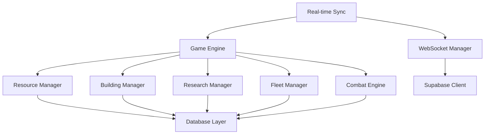

# System Patterns - Attrition Game Architecture

## System Architecture Overview

### High-Level Architecture
```
┌─────────────────────────────────────────────────────────────┐
│                    Web Browser Client                      │
├─────────────────────────────────────────────────────────────┤
│  React Frontend  │  Real-time WebSocket  │  HTTP APIs      │
├─────────────────────────────────────────────────────────────┤
│                 Supabase (Backend)                         │
├─────────────────────────────────────────────────────────────┤
│  PostgreSQL DB   │  Real-time Subscriptions │ Auth System   │
└─────────────────────────────────────────────────────────────┘
```

### Component Layers
1. **Client Layer**: React-based frontend with real-time updates
2. **API Layer**: RESTful APIs and WebSocket connections
3. **Service Layer**: Business logic and game mechanics
4. **Data Layer**: PostgreSQL with real-time subscriptions
5. **Infrastructure Layer**: Supabase hosting and scaling

## Key Technical Decisions

### Technology Stack Selection
- **Frontend**: React with TypeScript for type safety and modern development experience
- **Backend**: Supabase (PostgreSQL + Real-time APIs) for rapid development and scalability
- **Real-time**: WebSocket connections for live game state synchronization
- **Build System**: Vite for fast development and optimized production builds
- **Package Management**: pnpm for efficient monorepo dependency management

### Architecture Patterns
- **Microservices Approach**: Modular architecture with separate client/server packages
- **Event-Driven Design**: Game state changes trigger real-time updates via Supabase subscriptions
- **Repository Pattern**: Data access abstraction for database operations
- **Service Layer Pattern**: Business logic separation from data access and presentation

## Design Patterns in Use

### Creational Patterns
- **Factory Pattern**: Used for creating game entities (buildings, ships, research)
- **Singleton Pattern**: Applied to shared services (game state, resource managers)
- **Builder Pattern**: Complex object creation for fleet compositions and building configurations

### Structural Patterns
- **MVC Pattern**: Model-View-Controller separation in React components
- **Adapter Pattern**: Database result transformation to domain objects
- **Facade Pattern**: Simplified interfaces for complex game mechanics
- **Observer Pattern**: Real-time subscriptions for game state changes

### Behavioral Patterns
- **Command Pattern**: Encapsulating game actions (build, research, attack) for undo/replay
- **Strategy Pattern**: Different AI behaviors and combat algorithms
- **State Pattern**: Game phase management (setup, active play, paused states)
- **Mediator Pattern**: Centralized game state coordination

## Component Relationships

### Core Game Components


### Data Flow Architecture
1. **Player Action** → Frontend Component → Service Layer → Database
2. **Real-time Update** → Supabase Subscription → WebSocket → Frontend Update
3. **Game State Query** → Frontend → API Layer → Database → Response

## Critical Implementation Paths

### Game State Synchronization
- **Challenge**: Maintaining consistency across multiple players in real-time
- **Solution**: Supabase real-time subscriptions with optimistic updates
- **Implementation**: WebSocket connections for live updates, HTTP APIs for state queries
- **Conflict Resolution**: Server-side validation with client-side rollback on conflicts

### Resource Calculation Engine
- **Challenge**: Complex resource production, consumption, and storage calculations
- **Solution**: Centralized resource manager with atomic operations
- **Implementation**: Background workers for periodic calculations, real-time updates for player actions
- **Performance**: Indexed database queries with caching for frequently accessed data

### Combat System
- **Challenge**: Real-time fleet combat with multiple simultaneous engagements
- **Solution**: Event-driven combat engine with state machine implementation
- **Implementation**: Separate combat resolution service with battle result broadcasting
- **Scalability**: Asynchronous processing for multiple concurrent battles

## System Integration Points

### External Service Integrations
- **Authentication**: Supabase Auth for user management and session handling
- **File Storage**: Supabase Storage for game assets and user-generated content
- **Email Services**: Integration with email providers for notifications
- **Analytics**: Game telemetry and performance monitoring

### Internal Service Communication
- **Inter-service Communication**: Direct function calls within monorepo structure
- **Event Broadcasting**: Real-time events via Supabase subscriptions
- **State Sharing**: Centralized game state with subscription-based updates
- **Error Handling**: Comprehensive error propagation and logging

## Performance Optimization Patterns

### Caching Strategy
- **Client-side Caching**: React Query for API response caching and synchronization
- **Server-side Caching**: Redis for frequently accessed game data (planned)
- **Database Query Optimization**: Strategic indexing for complex game queries
- **Asset Optimization**: Code splitting and lazy loading for faster initial page loads

### Scalability Patterns
- **Horizontal Scaling**: Stateless service design for easy instance replication
- **Load Balancing**: Distribution of player connections across multiple servers
- **Database Optimization**: Read replicas for query distribution
- **Background Processing**: Queue-based processing for resource-intensive operations

## Security Architecture

### Authentication & Authorization
- **JWT-based Auth**: Supabase Auth with Row Level Security (RLS) policies
- **Session Management**: Secure token handling with automatic refresh
- **Permission System**: Role-based access control for game features

### Data Protection
- **Input Validation**: Comprehensive validation on all user inputs
- **SQL Injection Prevention**: Parameterized queries and stored procedures
- **XSS Prevention**: Content sanitization and CSP headers
- **CSRF Protection**: Token-based request validation

## Deployment Architecture

### Environment Strategy
- **Development**: Local development with hot reload and debugging tools
- **Testing**: Automated testing environment with data seeding
- **Staging**: Production-like environment for final validation
- **Production**: Optimized deployment with monitoring and logging

### CI/CD Pipeline
- **Build Process**: Automated builds with dependency management
- **Testing**: Comprehensive test suites across all layers
- **Deployment**: Automated deployment with rollback capabilities
- **Monitoring**: Performance and error tracking in production

## Error Handling & Resilience

### Error Management Strategy
- **Error Classification**: Categorization by severity and impact
- **Graceful Degradation**: Continued operation during non-critical failures
- **User Feedback**: Clear error messages with actionable guidance
- **Recovery Mechanisms**: Automatic retry and fallback procedures

### Monitoring & Observability
- **Performance Monitoring**: Real-time metrics collection and alerting
- **Error Tracking**: Comprehensive logging with context preservation
- **Health Checks**: Automated system health verification
- **Analytics**: Player behavior and game balance monitoring

## Future Architecture Considerations

### Route Migration Patterns (Phase 5)

#### UUID Validation Strategy
- **Pattern**: Standardized UUID format validation for Supabase primary keys
- **Implementation**: Regex-based validation using standard UUID v4 format
- **Code Pattern**:
  ```typescript
  const uuidRegex = /^[0-9a-f]{8}-[0-9a-f]{4}-[1-5][0-9a-f]{3}-[89ab][0-9a-f]{3}-[0-9a-f]{12}$/i;
  if (!uuidRegex.test(messageId)) {
    return res.status(400).json({
      success: false,
      code: 'INVALID_MESSAGE_ID',
      message: 'Invalid message ID format'
    });
  }
  ```
- **Benefits**: Early validation prevents invalid database queries and improves security
- **Consistency**: Applied across all routes that handle Supabase entity IDs

#### Supabase Query Patterns

##### Optimized Count Queries
- **Pattern**: Use `head: true` for count-only queries to avoid data transfer
- **Implementation**:
  ```typescript
  const { count, error } = await supabase
    .from('messages')
    .select('*', { count: 'exact', head: true })
    .eq('to_user_id', uid);
  ```
- **Benefits**: Reduced bandwidth and faster response times for pagination

##### Complex Authorization Queries
- **Pattern**: Single query with multiple conditions for access control
- **Implementation**:
  ```typescript
  const { data: message, error } = await supabase
    .from('messages')
    .select('*')
    .eq('id', messageId)
    .or(`from_user_id.eq.${uid},to_user_id.eq.${uid}`)
    .maybeSingle();
  ```
- **Benefits**: Atomic authorization check without multiple queries

##### Pagination with Range Queries
- **Pattern**: Use `range()` method for efficient pagination
- **Implementation**:
  ```typescript
  const { data: messages, error } = await supabase
    .from('messages')
    .select('*')
    .eq('to_user_id', uid)
    .order('created_at', { ascending: false })
    .range(offset, offset + limit - 1);
  ```
- **Benefits**: Database-level pagination for large datasets

#### Authorization Security Patterns

##### Dual-Role Access Control
- **Pattern**: Verify user is either sender or recipient for message access
- **Implementation**: OR conditions in queries ensure proper access control
- **Security Benefit**: Prevents unauthorized access to private messages

##### Operation-Specific Permissions
- **Pattern**: Different authorization rules for different operations
- **Examples**:
  - Read/Mark as Read: User must be recipient
  - Delete: User can be either sender or recipient
  - Send: User must be authenticated sender
- **Implementation**: Query filters enforce permissions at database level

##### Input Validation Layering
- **Pattern**: Multi-layer validation approach
- **Layers**:
  1. **Format Validation**: UUID format, field length, required fields
  2. **Business Logic Validation**: User existence, message ownership
  3. **Database Constraints**: Foreign key relationships, data integrity

#### Error Handling Patterns

##### Graceful Degradation
- **Pattern**: Continue operation with partial failures when possible
- **Implementation**: Count queries with individual error handling
- **Example**: Return available counts even if some queries fail

##### Structured Error Responses
- **Pattern**: Consistent error response format with error codes
- **Implementation**:
  ```typescript
  return res.status(400).json({
    success: false,
    code: 'INVALID_MESSAGE_ID',
    message: 'Invalid message ID format'
  });
  ```
- **Benefits**: Better client-side error handling and debugging

### Planned Enhancements
- **Microservices Evolution**: Potential separation of game services into independent deployments
- **Event Sourcing**: Historical game state reconstruction for advanced features
- **API Gateway**: Centralized request routing and rate limiting
- **Service Mesh**: Enhanced inter-service communication and observability

### Scalability Targets
- **Concurrent Users**: Support for 10,000+ simultaneous players
- **Database Performance**: Sub-millisecond query response times
- **Global Distribution**: Multi-region deployment for reduced latency
- **Resource Efficiency**: Optimized resource usage for cost-effective scaling

**Last Updated**: 2025-10-08T15:05:00Z
**Document Status**: Active